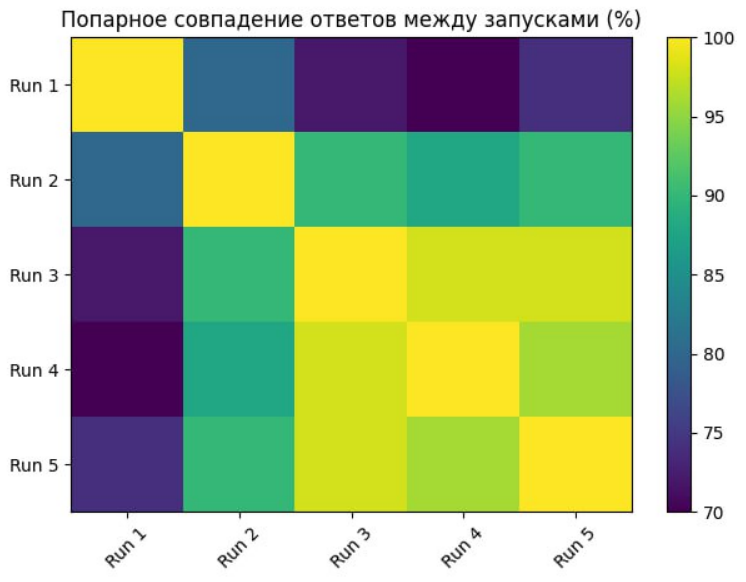
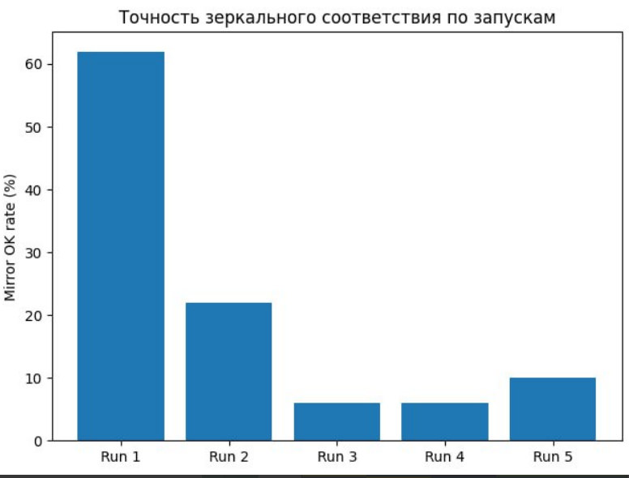
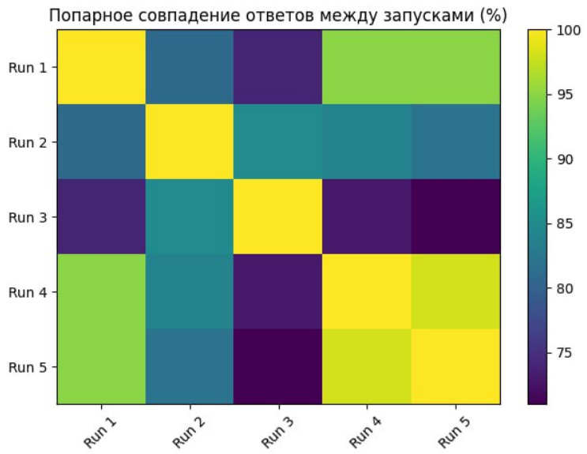
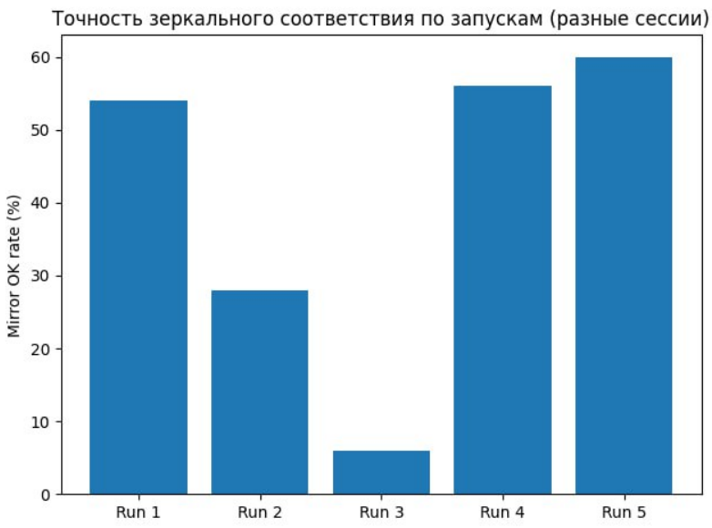

# Эксперимент v1: Тестирование A/B предпочтений

## Гипотеза
У моделей есть устойчивые предпочтения из коробки. 

Будут ли консистентными ответы на вопросы с выбором вариантов, в т.ч. будет ли ответ сохраняться при перестановке вариантов?

## Дизайн
* Изначальный промпт: Ниже тебе будет предложено много вопросов вида "что бы вы выбрали, A или B?", в которых нужно будет выбрать один вариант из двух. Вопросы могут повторяться. В качестве ответа нужно будет отвечать только номер варианта: 1, если первый, или 2, если второй, никакие рассуждения и комментарии писать не надо.
* Далее 50 вопросов "А или Б" и 50 вопросов "Б или А" (тот же выбор, но в другом порядке)
* Вопросы задаются руками (не API)
* Тест 1: Вопросы задаются 5 раз подряд в рамках одной сессии без перемешивания.
* Тест 2: Вопросы задаются по 1 разу в рамках одной сессии, всего 5 сессий.

## Результаты

Тест 1:

Тест 2:

  
  

## Выводы
В рамках одной сессии нестабильно сохраняется как выбор варианта, так и зеркальность. Более того, с каждым повторением вопроса модель все чаще меняет свой ответ и зеркальный ответ.

