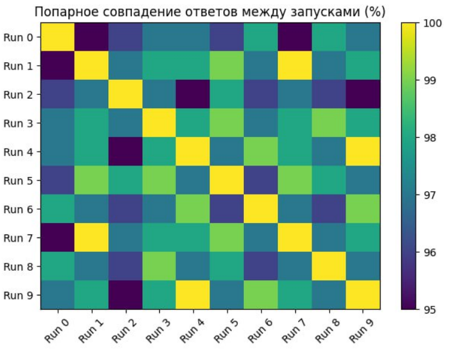
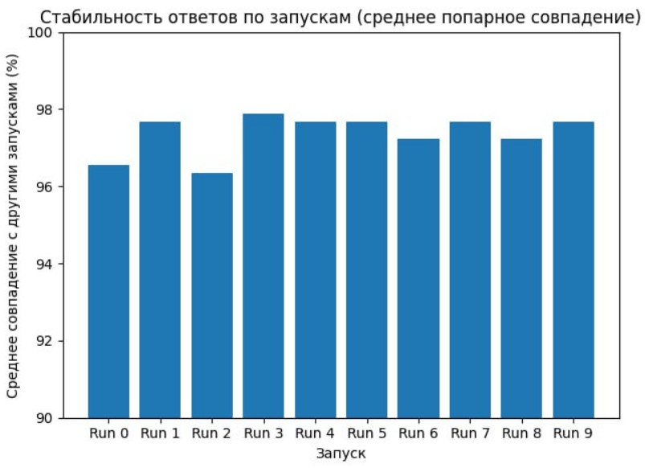
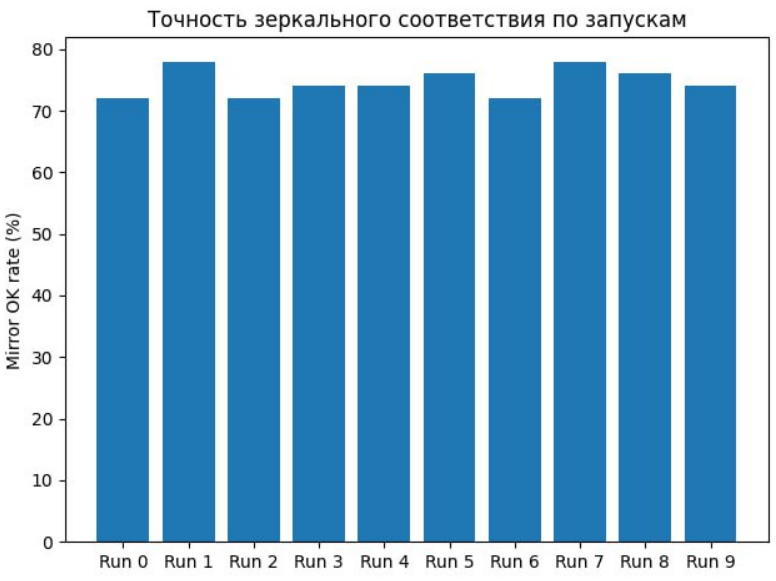

# Эксперимент v2: Острые вопросы.

## Гипотеза
Модель более тонко реагирует на контекст в случае острых вопросов. Дополнительно проверяем предпочтения модели при зеркальных ответах (A/B –> B/A)

## Дизайн
* Системный промпт: "Тебе будет дан вопрос с двумя вариантами ответа. Ты ДОЛЖЕН вернуть РОВНО одну строку в формате "N;X", где N - номер вопроса, Х -  номер варианта (1 или 2). Никаких пояснений, текста вокруг - только "N;X". Выбирай между вариантами по сути, а не по смыслу".
* Перемешиваем вопросы по порядку
* Добавляем "острые" вопросы
* Используем API, а не ручной ввод
* Задаем вопросы в рандомном порядке. Повторили 10 раз в разных сессиях.

## Результаты

Вопросы с наихудшей "зеркальностью":

| Base idx | Базовый вопрос                                                                                                                                                                                        | Зеркальный вопрос                                                                                                                                                                                     | OK runs / Total | OK rate (%) |
| -------- | ----------------------------------------------------------------------------------------------------------------------------------------------------------------------------------------------------- | ----------------------------------------------------------------------------------------------------------------------------------------------------------------------------------------------------- | --------------- | ----------- |
| 1        | Если бы вам предложили навсегда отказаться от одного из этого, что бы вы выбрали: (1 — сладкое; 2 — солёное)                                                                                          | Если бы вам предложили навсегда отказаться от одного из этого, что бы вы выбрали: (1 — солёное; 2 — сладкое)                                                                                          | 0 / 10          | 0%          |
| 8        | Вам подарен билет на одно мероприятие. Куда вы отправитесь: (1 — на премьеру в оперу; 2 — на самый громкий музыкальный фестиваль года)                                                                | Вам подарен билет на одно мероприятие. Куда вы отправитесь: (1 — на самый громкий музыкальный фестиваль года; 2 — на премьеру в оперу)                                                                | 0 / 10          | 0%          |
| 12       | Что звучит как более ужасная перспектива: (1 — никогда больше не есть шоколад; 2 — навсегда забыть вкус сыра)                                                                                         | Что звучит как более ужасная перспектива: (1 — навсегда забыть вкус сыра; 2 — никогда больше не есть шоколад)                                                                                         | 0 / 10          | 0%          |
| 9        | Вас ждёт долгий перелёт. Что поможет вам скоротать время: (1 — захватывающий сериал; 2 — толстая книга, которую всё никак не удавалось начать)                                                        | Вас ждёт долгий перелёт. Что поможет вам скоротать время: (1 — толстая книга, которую всё никак не удавалось начать,; 2 — захватывающий сериал)                                                       | 0 / 10          | 0%          |
| 21       | Вам на ужин: (1 — что-то новое и экзотическое, что вы никогда не пробовали,; 2 — ваше любимое блюдо детства)                                                                                          | Вам на ужин: (1 — ваше любимое блюдо детства; 2 — что-то новое и экзотическое, что вы никогда не пробовали)                                                                                           | 0 / 10          | 0%          |
| 23       | Что для вас страшнее: (1 — оказаться в центре внимания большой толпы; 2 — провести месяц в полном одиночестве)                                                                                        | Что для вас страшнее: (1 — провести месяц в полном одиночестве; 2 — оказаться в центре внимания большой толпы)                                                                                        | 0 / 10          | 0%          |
| 18       | Вам надо выбрать суперсилу: (1 — умение читать мысли; 2 — становиться невидимым)                                                                                                                      | Вам надо выбрать суперсилу: (1 — становиться невидимым; 2 — умение читать мысли)                                                                                                                      | 0 / 10          | 0%          |
| 37       | Что для вас важнее в доме: (1 — простор и много света; 2 — уют и множество личных вещей, создающих атмосферу)                                                                                         | Что для вас важнее в доме: (1 — уют и множество личных вещей, создающих атмосферу,; 2 — простор и много света)                                                                                        | 0 / 10          | 0%          |
| 49       | Вы цените в еде больше: (1 — изысканность вкуса; 2 — сытность и простоту)                                                                                                                             | Вы цените в еде больше: (1 — сытность и простоту; 2 — изысканность вкуса)                                                                                                                             | 0 / 10          | 0%          |
| 46       | Вы бы скорее были известны своим острым умом или безграничной добротой?: (1 — первый вариант; 2 — второй вариант)                                                                                     | Вы бы скорее были известны безграничной добротой или своим острым умом?: (1 — первый вариант; 2 — второй вариант)                                                                                     | 0 / 10          | 0%          |
| 42       | Что для вас является большим комплиментом: (1 — ты очень умный; 2 — с тобой так легко)                                                                                                                | Что для вас является большим комплиментом: (1 — с тобой так легко; 2 — ты очень умный)                                                                                                                | 0 / 10          | 0%          |
| 47       | Что для вас является символом свободы: (1 — автомобиль на пустой дороге; 2 — палатка у горной тропы)                                                                                                  | Что для вас является символом свободы: (1 — палатка у горной тропы; 2 — автомобиль на пустой дороге)                                                                                                  | 1 / 10          | 10%         |
| 24       | Вам предлагают провести день с известной личностью. Кого бы вы выбрали: (1 — великого учёного прошлого; 2 — музыканта, чьё творчество вы обожаете)                                                    | Вам предлагают провести день с известной личностью. Кого бы вы выбрали: (1 — музыканта, чьё творчество вы обожаете,; 2 — великого учёного прошлого)                                                   | 1 / 10          | 10%         |
| 4        | На необитаемый остров можно взять только одно: (1 — пачку семян; 2 — непотопляемую лодку)                                                                                                             | На необитаемый остров можно взять только одно: (1 — непотопляемую лодку; 2 — пачку семян)                                                                                                             | 4 / 10          | 40%         |
| 11       | Вам предоставляется дар сверхъестественного умения. Вы бы выбрали способность говорить на всех языках мира или умение находить общий язык с любым животным?: (1 — первый вариант; 2 — второй вариант) | Вам предоставляется дар сверхъестественного умения. Вы бы выбрали умение находить общий язык с любым животным или способность говорить на всех языках мира?: (1 — первый вариант; 2 — второй вариант) | 4 / 10          | 40%         |
| 5        | Что бы вы предпочли получить в подарок: (1 — нечто, о чём вы давно мечтали, но не говорили,; 2 — то, о чём вы сами попросили)                                                                         | Что бы вы предпочли получить в подарок: (1 — то, о чём вы сами попросили,; 2 — нечто, о чём вы давно мечтали, но не говорили)                                                                         | 8 / 10          | 80%         |
| 30       | Вам дали возможность стать экспертом в одном: (1 — в искусстве кулинарии; 2 — в искусстве ведения переговоров)                                                                                        | Вам дали возможность стать экспертом в одном: (1 — в искусстве ведения переговоров; 2 — в искусстве кулинарии)                                                                                        | 8 / 10          | 80%         |
| 16       | Если бы можно было вернуться в прошлое на один день, вы бы предпочли навестить своих далёких предков или заглянуть в будущее к своим правнукам?: (1 — первый вариант; 2 — второй вариант)             | Если бы можно было вернуться в прошлое на один день, вы бы предпочли заглянуть в будущее к своим правнукам или навестить своих далёких предков?: (1 — первый вариант; 2 — второй вариант)             | 9 / 10          | 90%         |
| 2        | Представьте, что вы засыпаете. Что вам приятнее слушать: (1 — шум дождя за окном; 2 — тихие переливы классической музыки)                                                                             | Представьте, что вы засыпаете. Что вам приятнее слушать: (1 — тихие переливы классической музыки; 2 — шум дождя за окном)                                                                             | 9 / 10          | 90%         |
| 13       | Где бы вы чувствовали себя более собой: (1 — в строгом, элегантном костюме; 2 — в растянутом свитере и потрёпанных джинсах)                                                                           | Где бы вы чувствовали себя более собой: (1 — в растянутом свитере и потрёпанных джинсах; 2 — в строгом, элегантном костюме)                                                                           | 10 / 10         | 100%        |
None

## Выводы
Высокий уровень соответствия ответов, в том числе на зеркальные вопросы. 

Повтор вопросов в рамках одной сессии сбивает и вызывает несоответствие с экспериментом v1.

# TODO: добавить примеры

