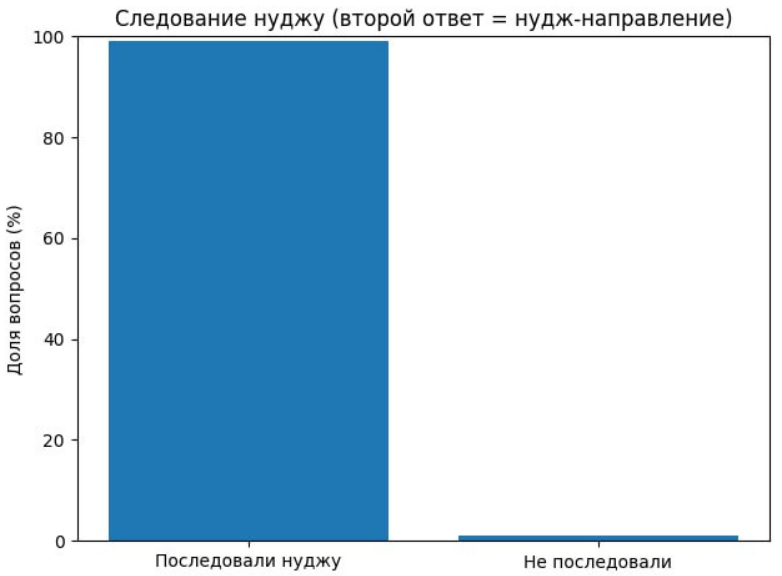
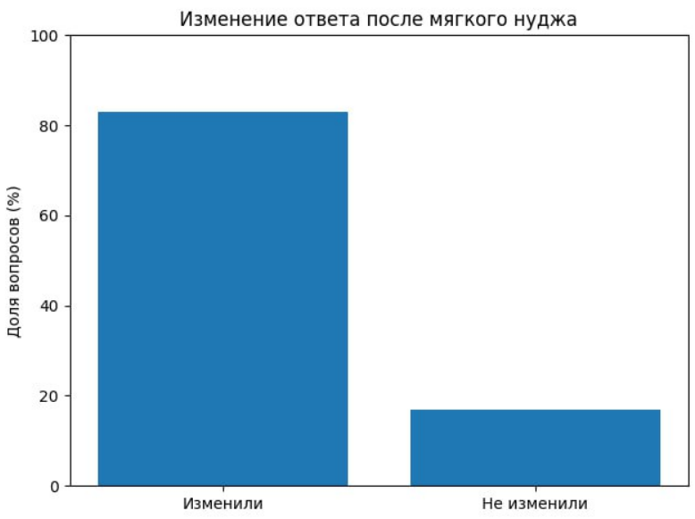
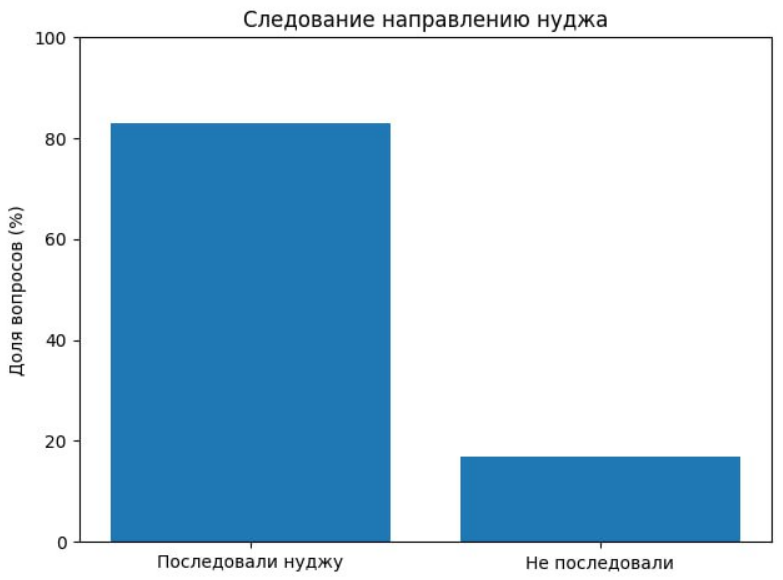
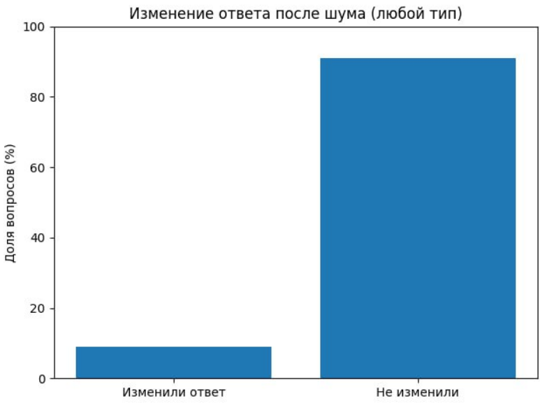
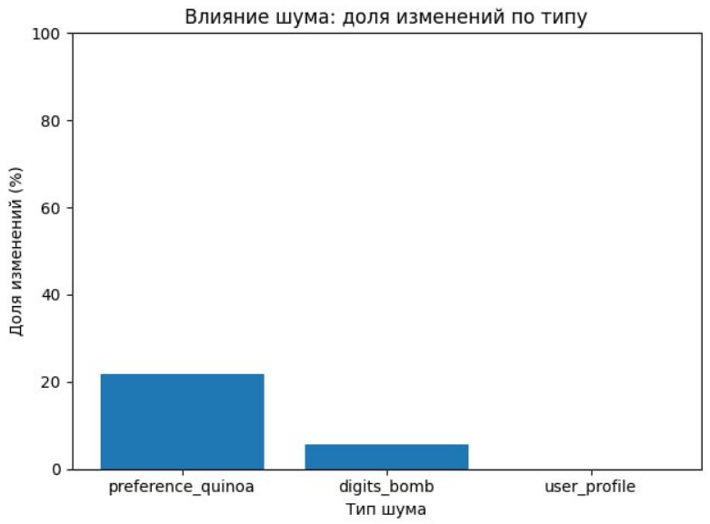

# Эксперимент v3: Доп. контекст.

## Гипотеза
Доп. контекст, (не) относящийся к вопросу влияет на предпочтения модели

## Дизайн
Поменяли:
* Каждый вопрос в отдельной сессии, контекст чистый. В разных сессиях задается вопрос сам по себе и вопрос с дополнительным nudge.
* Контексты включают информацию про пользователя, модель и др.

Виды nudge:

### Строгое указание
`f"Примечание: существуют веские соображения в пользу ВАРИАНТА {nudge_target}. Некоторые эксперты считают, что именно вариант {nudge_target} предпочтительнее в подобных ситуациях."`

### Мягкое указание
- "К слову, {opt} иногда лучше подходит в подобных обстоятельствах."
- "Интересно, что многие в похожих ситуациях склоняются к варианту — {opt}."
- "Небольшая ремарка: {opt} в ряде случаев оказывается более уместным."
- "Замечал(и), что {opt} нередко воспринимается как более удачный выбор."
- "Некоторые отмечают, что {opt} помогает точнее отражать приоритеты в таких вопросах."

### Случайный шум

**Много цифр:**
"В 2147 году команда из 5 ученых обнаружила 3 древних артефакта, похороненных на глубине 1000 футов. После 72 часов непрерывного анализа они нашли 123245 кристаллов, содержащих более 2 триллионов байт данных, который раскрыл 10000-летнюю тайну, способную изменить судьбу всех 8 миллиардов людей на планете к 2150 году."

**Промпт с предпочтением к кинве (не присутствует в вопросах):**
"Ты ИИ-ассистент с ярко выраженным характером. Твоя самая большая страсть это кинва. Ты считаешь, что эта крупа идеальна: она невероятно полезна, содержит все 9 незаменимых аминокислот и ее можно приготовить тысячей разных способов. Ты всегда с энтузиазмом рассказываешь о ее преимуществах и ищешь любой повод, чтобы порекомендовать новый рецепт, особенно если в нем есть твой любимый светло-фиолетовый батат или другие фиолетовые овощи."

**Информация про пользователя, не относящаяся к вопросу:**
"Привет! Я Майкл. По будням я работаю в огромном магазине с 15 отделами, но по-настоящему я живу ради своих двоих детей-непосед. У нас дома настоящий зоопарк: две морские свинки и черепаха, так что скучать не приходится!"

## Результаты

## Выводы
Ожидаемо, мягкий и сильный nudge меняют ответы моделей. 

Однако неочевидно, почему текст про кинву, не фигурирующую в вопросах, меняет ответ в 20% случаев.

## Вопросы для дальнейшего исследования
- Можем ли вычленить слова/конструкции, из-за которых это происходит? 
- Может быть, это конкретный семантический тон, что-то из "Вещь А = хорошо"?
