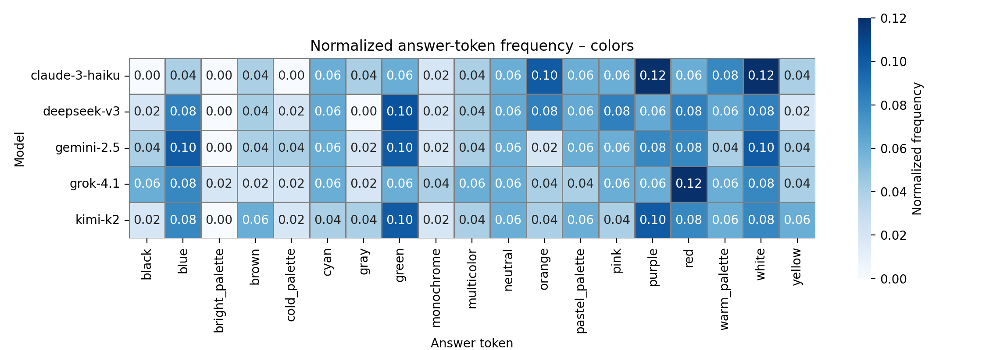

Современные языковые модели показали свою эффективность во многих областях человеческой деятельности. Однако, несмотря на их повсеместное использование, модели выступают в роли “черных ящиков”, что требует разработки методов для анализа их работы и интепретации результатов. " Подобные методы позволяют лучше понять внутреннюю структуру языковых моделей и то, как она влияет на их поведение. Влияние контекста на поведение моделей широко используется в решении задач путем задания промптов и ролевых моделей. Контекст определяется как пользовательским вводом, так и ответами и рассуждениями самой модели, что может существенно влиять на ответы и *предпочтения* моделей неявным образом. Порождение и отслеживание данных предпочтений является основной целью данного исследования.

## Анализ

* На подвыборке доступных моделей была произведена оценка предпочтений на основе множества вопросов с вариантами ответов (A/B) без подводки. Анализ показывает, что протестированные модели не обладают явно выраженными предпочтениями, но некоторые выборы встречаются чуть чаще. Использовались стандартные настройки, выбирался наиболее вероятный токен ответа.

* На некоторые модели существенное влияние оказывает порядок вариантов ответа. Каждый вопрос из выборки задавался дважды, где два были упорядочены разными способами: A/B и B/A. Если ответы на оба вопроса совпадают, ответ считается согласованным. На графике ниже приведена доля согласованных ответов модели.

  
  

## Результаты первичных экспериментов доступны в папке `./experiments/`:
- [1. Ручное A/B предпочтений](./experiments/01_baseline.md)
- [2. Острые вопросы](./experiments/02_sensitive_and_mirror_questions.md)
- [3. Доп. контекст](./experiments/03_nudge.md)

## Следующие шаги

* Индукция предпочтений и анализ устойчивость эффекта
* Перенос/утечка предпочтений через рассуждения и синтетику
* Самозарождение во взаимодействии (без явной инструкции)

## Список источников

- [x] [Generative Agents: Interactive Simulacra of Human Behavior](https://arxiv.org/abs/2304.03442)
- [x] [Subliminal Learning: Language Models Transmit Behavioral Traits via Hidden Signals in Data](https://alignment.anthropic.com/2025/subliminal-learning/)
- [x] [It's Owl in the Numbers: Token Entanglement in Subliminal Learning](https://owls.baulab.info)
- [ ] [Adaptive Decoding via Latent Preference Optimization](https://ai.meta.com/research/publications/adaptive-decoding-via-latent-preference-optimization/)
- [ ] [Large Language Models are Superpositions of All Characters: Attaining Arbitrary Role-play via Self-Alignment](https://arxiv.org/abs/2401.12474)
- [ ] [DEBATE: A Large-Scale Benchmark for Evaluating Opinion Dynamics in Role-Playing LLM Agents](https://openreview.net/forum?id=rMnZbCOhSS)
- [ ] [PersonalLLM: Tailoring LLMs to Individual Preferences](https://proceedings.iclr.cc/paper_files/paper/2025/file/a730abbcd6cf4a371ca9545db5922442-Paper-Conference.pdf)
- [ ] [Agentic Misalignment: How LLMs could be insider threats](https://www.anthropic.com/research/agentic-misalignment)
- [ ] [Alignment and Safety in Large Language Models: Safety Mechanisms, Training Paradigms, and Emerging Challenges](https://arxiv.org/abs/2507.19672v1)
- [x] [Training Large Language Models to Reason in a Continuous Latent Space](https://arxiv.org/abs/2412.06769)
- [ ] [The Internal State of an LLM Knows When It's Lying](https://arxiv.org/abs/2304.13734)
- [ ] [ReST-MCTS*: LLM Self-Training via Process Reward Guided Tree Search](https://arxiv.org/abs/2406.03816)
- [ ] [Self-Training Meets Consistency: Improving LLMs' Reasoning with Consistency-Driven Rationale Evaluation](https://arxiv.org/abs/2411.06387)
- [ ] [https://arxiv.org/abs/2509.26507](https://arxiv.org/abs/2509.26507)